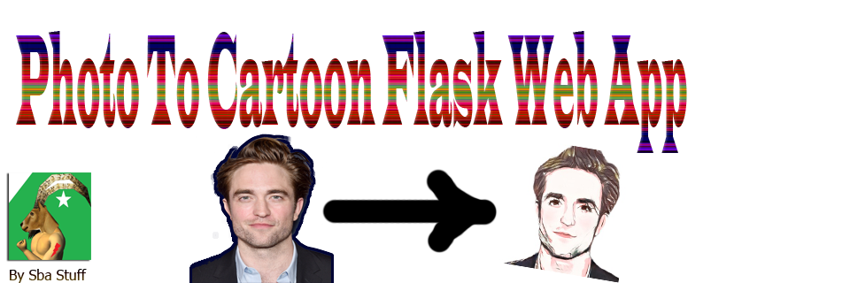
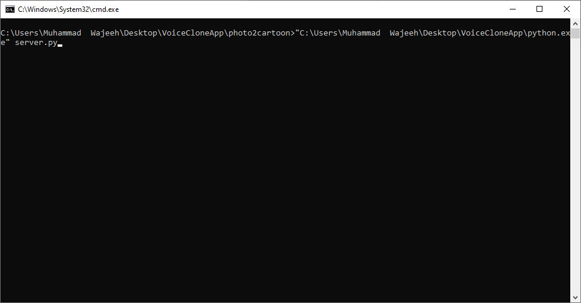
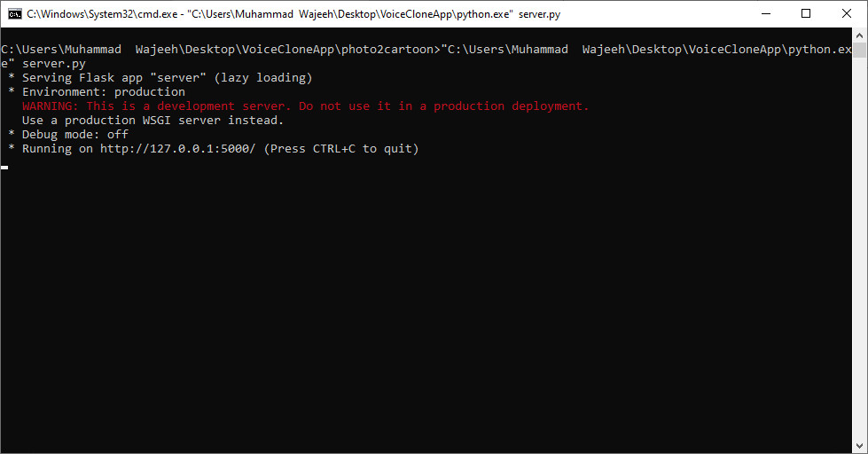
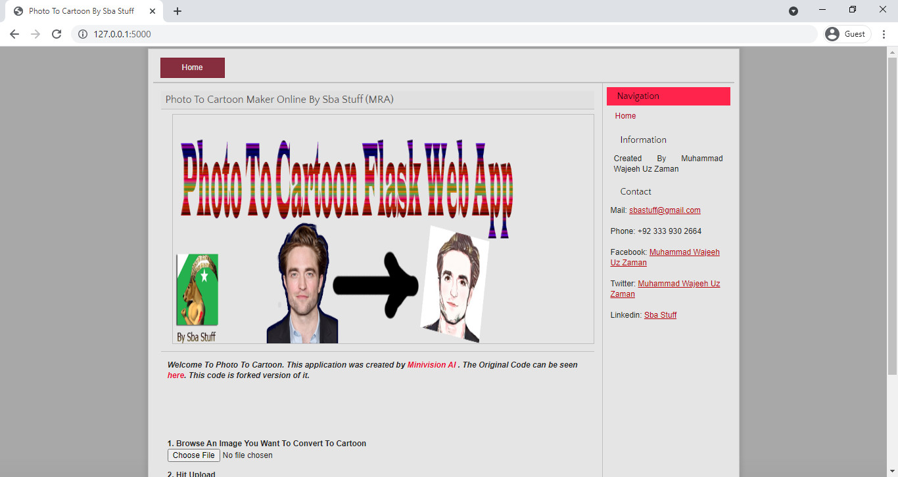
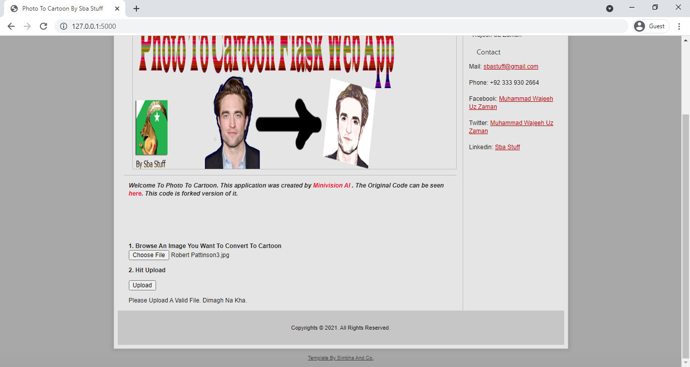
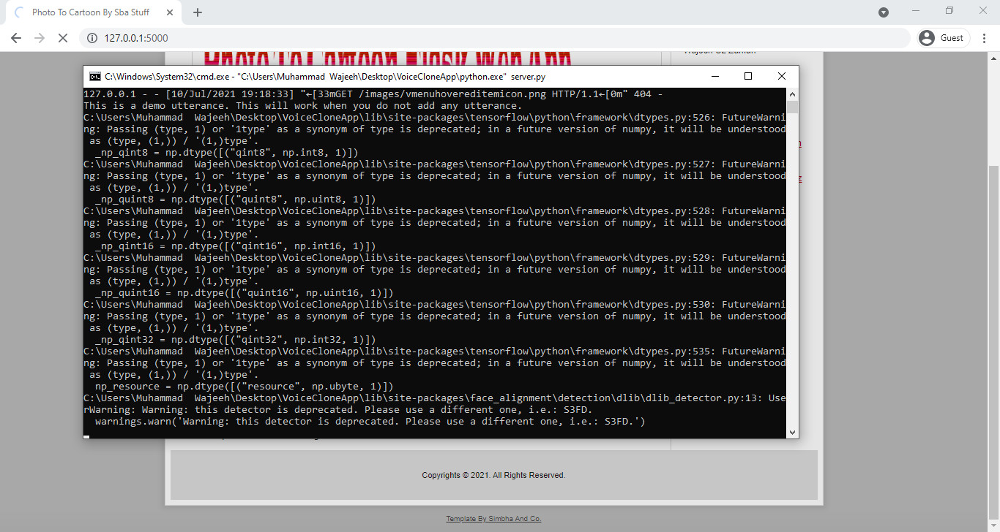
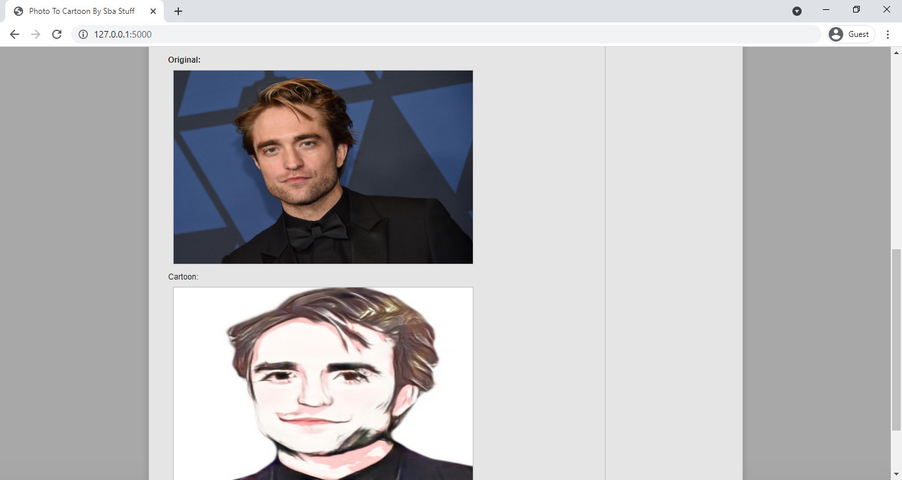
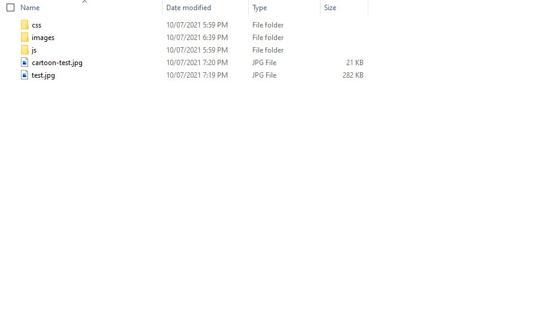

<div align='center'>
  
</div>

(Photo to Cartoon)

You can also try on this page: [https://ai.minivision.cn/#/coreability/cartoon](https://ai.minivision.cn/#/coreability/cartoon)

**Updates**
- `2021.07.10`: (This Repository): Release of Flask Based Web App To Upload Content and get results rather than writing commands。
- `2020.12.2`: [photo2cartoon-paddle](https://github.com/minivision-ai/photo2cartoon-paddle) is released。
- `2020.12.1`: Add onnx test model, see [test_onnx.py](./test_onnx.py) for details.

## Introduce

The aim of portrait cartoon stylization is to transform real photos into cartoon images with portrait's ID information and texture details. We use Generative Adversarial Network method to realize the mapping of picture to cartoon. Considering the difficulty in obtaining paired data and the non-corresponding shape of input and output, we adopt unpaired image translation fashion.

The results of CycleGAN, a classic unpaired image translation method, often have obvious artifacts and are unstable. Recently, Kim et al. propose a novel normalization function (AdaLIN) and an attention module in paper "U-GAT-IT" and achieve exquisite selfie2anime results.

Different from the exaggerated anime style, our cartoon style is more realistic and contains unequivocal ID information. To this end, we add a Face ID Loss (cosine distance of ID features between input image and cartoon image) to reach identity invariance. 

We propose a Soft Adaptive Layer-Instance Normalization (Soft-AdaLIN) method which fuses the statistics of encoding features and decoding features in de-standardization. 

Based on U-GAT-IT, two hourglass modules are introduced before encoder and after decoder to improve the performance in a progressively way.

We also pre-process the data to a fixed pattern to help reduce the difficulty of optimization. For details, see below.

<div align='center'>
  
</div>

## Start

### Requirements
- python 3.6
- pytorch 1.4
- tensorflow-gpu 1.14
- face-alignment
- dlib
- onnxruntime
- flask

### Clone

```
git clone https://github.com/minivision-ai/photo2cartoon.git
cd ./photo2cartoon
```

### Download

[Google Drive](https://drive.google.com/open?id=1lsQS8hOCquMFKJFhK_z-n03ixWGkjT2P) | [Baidu Cloud](https://pan.baidu.com/s/1MsT3-He3UGipKhUi4OcCJw) acess code: y2ch

1. Put the pre-trained photo2cartoon model **photo2cartoon_weights.pt** into `models` folder (update on may 4, 2020).
2. Place the head segmentation model **seg_model_384.pb** in `utils` folder. 
3. Put the pre-trained face recognition model **model_mobilefacenet.pth** into `models` folder (From [InsightFace_Pytorch](https://github.com/TreB1eN/InsightFace_Pytorch)).
4. Open-source cartoon dataset **`cartoon_data/`** contains `trainB` and `testB`.
5. Put the photo2cartoon onnx model **photo2cartoon_weights.onnx** [Google Drive](https://drive.google.com/file/d/1PhwKDUhiq8p-UqrfHCqj257QnqBWD523/view?usp=sharing) into `models` folder.

### Test

Browse and test on any photo.
```
python server.py
```

#### Step By Step

<b>1: Run The Server</b></br>
<div align='center'>
  
</div>

<b>2: You Will be Notified when the server is run.</b></br>
<div align='center'>
  
</div>

<b>3: Copy URL and Paste In Browser</b></br>
<div align='center'>
  
</div>

<b>4: Browse image and hit upload</b></br>
<div align='center'>
  
</div>

<b>5: Progress Can Be Seen On Console</b></br>
<div align='center'>
  
</div>

<b>6: Download Generated Image. Please Keep in Mind that upload and generated image is replaced everytime.</b></br>
<div align='center'>
  
</div>

<b>7: Generated image and uploaded image can be seen in static folder with test-cartoon.jpg and test.jpg respectively.</b></br>
<div align='center'>
  
</div>

## Youtube Video
Click On Link To Watch Youtube Video.</br>
[](https://www.youtube.com/watch?v=1HSppByqxpg)


## Q&A
#### Q：Why is the result of this project different from mini program?

A: For better performance, we customized the cartoon data (about 200 images) when training model for mini program. We also improved input size for high definition. Besides, we adopted our internal recognition model to calculate Face ID Loss which is much better than the open-sourced one used in this repo.

#### Q: How to select best model?

A: We trained model about 200k iterations, then selected best model according to FID metric.

#### Q: About face recognition model.

A: We found that the experimental result calculated Face ID Loss by our internal recognition model is much better than the open-sourced one. You can try to remove Face ID Loss if the result is unstable.

#### Q：Can I use the segmentation model to predict half-length portrait?
A：No. The model is trained for croped face specifically.

## Reference

U-GAT-IT: Unsupervised Generative Attentional Networks with Adaptive Layer-Instance Normalization for Image-to-Image Translation [[Paper](https://arxiv.org/abs/1907.10830)][[Code](https://github.com/znxlwm/UGATIT-pytorch)]

[InsightFace_Pytorch](https://github.com/TreB1eN/InsightFace_Pytorch)
